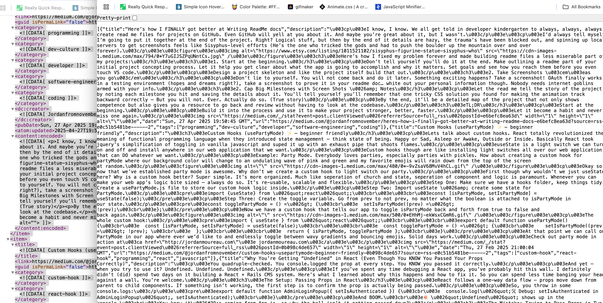

# Medium Well the API

Open source project for turn Medium's dirty XML rss feed for @username into neatly parsed json objects. Because we can. Doing our part to tidy up the internet.

## Project Goal

An API that's lightweight, easy to implent and produces objects for article content from a username feed via **Medium.com**

## Tech Stack

- RoR (API mode)
- Nokogiri for XML parsing
- Heroku for Deployment
- Vercel for Landing Page + Playground

## How To Use

Check out **mediumwell.api** for documentation and demonstration. Note for me: Flesh this out later.

## Steps to Build

### Create a new Rails Project:

`rails new medium_well_api --api -T`

### Used Nokogirl to parse XML

- Article title
- description
- Publishing Date
- Tags
- Url
- image?

### designed API endpoint

`GET /api/v1/articles?profile=@username`

### Deployed to Heroku

- Deployed API to Heroku using the Eco DYno plan for cost efficiency
- Configured environment for fast stateless responses without a database

### Landing Page & Live Playground

- Built landing page \*\*mediumwell.api
- implemented a live API playground allowing users to test the API direct to the site by inputting a user name
- Deployed the landing page to Vercel

## Issues & Resolutions

### first big problem

Parsing description without a clear xml indicator. Solution: Sanitize content:encoded and return only the first 250 characters.



```
def self.sanitize_description(content)
return '' if content.blank?

      doc = Nokogiri::HTML(content)
      first_paragraph = doc.at('p')&.text || ''
      first_paragraph.truncate(250) # Adjust length as needed
    end

```

created a class for sanitize description paragraph and limit characters.


Note:
`http://localhost:3000/api/v1/articles?profile=@jordanfromnovember`
is the correct testing url.
